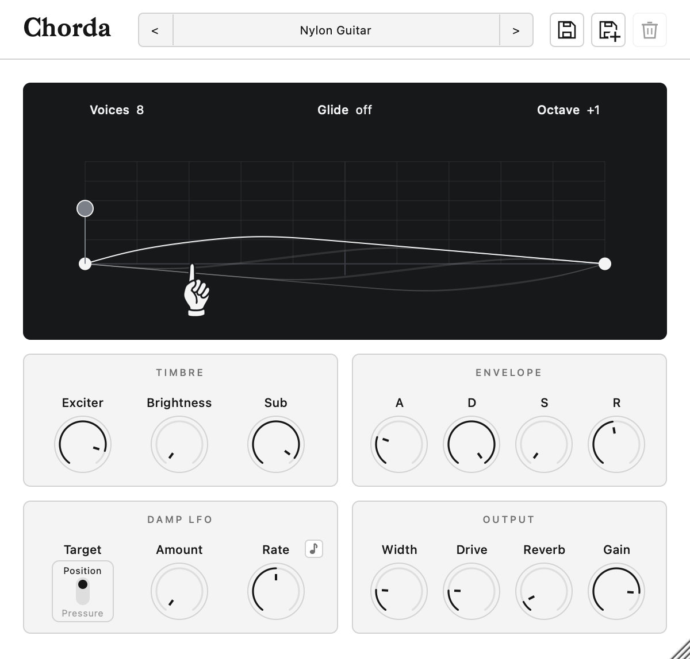
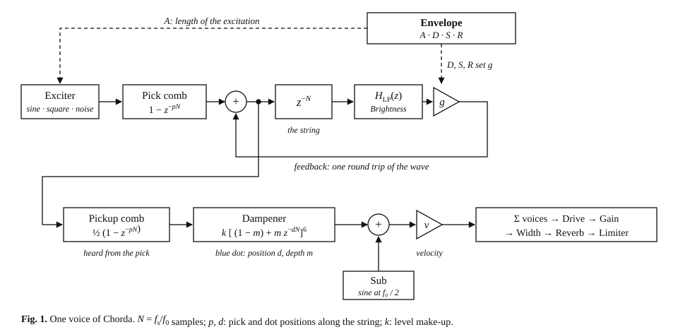

# Chorda

Strings, at hand.

Chorda lets you shape a simulated string into many instruments: from deep basses to bright harps, from quick plucks to bowed swells.

Built on Karplus-Strong synthesis, Chorda extends the algorithm with accurate tuning at every pitch, full envelope control, a movable pluck point and a harmonic dampener driven by two LFOs, all behind a few intuitive controls.

Explore what it can do with 15 built-in presets.

AU, VST3 and standalone, for macOS, Windows and Linux.



## Download

Get the file for your system from
[Releases](https://github.com/robert0-ch1/Chorda/releases/latest).

macOS: open `Chorda-macOS.pkg` and pick what to install: the AU, the VST3,
the standalone app, or all three. The installer is not signed by Apple yet, so
the first time macOS stops it: open System Settings, Privacy & Security, and
click Open Anyway.

Windows: run `Chorda-Windows.exe` and pick the VST3, the standalone app, or
both. Windows may warn that the publisher is unknown: click More info, then
Run anyway.

Linux: unzip `Chorda-Linux.zip`, copy `Chorda.vst3` to `~/.vst3`. The
standalone app is `./Chorda`.

Then rescan plugins in your DAW.

## Controls

| Control | What it does |
|---|---|
| Pick | Where the string is plucked. A comb filter, 1 − z<sup>−pN</sup>, on the pluck and on what you hear, like a pickup under the pick. |
| Damp | The dampener: a six-stage comb after the string that keeps the harmonics with a node under the dot. |
| Exciter | What goes into the string: sine, square or noise burst, crossfaded and level-matched. |
| Brightness | Low-pass inside the loop: every round trip takes more treble away. |
| Sub | A sine one octave down, following the string's level. |
| Attack | How long the exciter feeds the string: ms for a pluck, up to 2 s for a bow. |
| Decay, Release | Seconds to fall 60 dB with the key held, and after; sets the loop gain g. |
| Sustain | The level where the string stops losing energy and holds. |
| Damp LFO | Two sine LFOs on the dot's position and depth, free or tempo-synced. |
| Voices, Glide, Octave | Mono, Legato or up to 64 voices; pitch glide; ±2 octaves. |
| Width, Drive, Reverb, Gain | Stereo ensemble; 2x oversampled valve drive; reverb send. |

Fifteen presets, from basses to guitars, keys and pads, are there to start from.

## System Diagram



## Build it yourself

You need CMake 3.22+ and a C++17 compiler; JUCE is downloaded for you.

```bash
cmake -B build -DCMAKE_BUILD_TYPE=Release
cmake --build build --config Release
```

The plugins and the app land in `build/Chorda_artefacts/Release/`. Run the
tests with `ctest --test-dir build -C Release`.

## License

Chorda is released under the [GNU General Public License v3](LICENSE). It is
built with [JUCE](https://juce.com), used under its open-source licence. The
title typeface is Bagnard by Sebastien Sanfilippo, under the SIL Open Font
License.
